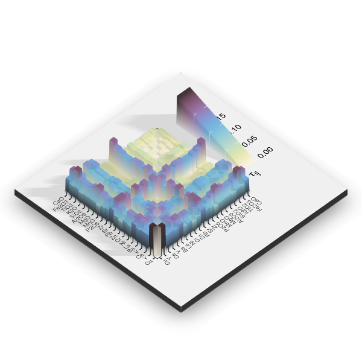

```{r setup, include = FALSE}
# Remarque : par défaut, le dossier dans lequel sont évalués les morceaux de 
# code par `knitr` est celui du document Rmd. 
knitr::opts_knit$set(
  root.dir = NULL
)
# Remarque : pour rendre le document en Rmarkown, une session séparée est créée
# en arrière-plan par RStudio. Les objets présents dans l'environnement global 
# de la session interactive ne sont donc pas accessibles. 
# Pour utiliser les objets de la session courrante, il faut donc
# soit passer l'option `cache.lazy = TRUE` dans `knitr::opts_chunk$set`, 
# soit utiliser `rmarkdown::render()` dans la console.

# Remarque : le compendium est conçu comme un package R, une alternative aux 
# deux imports précédents est d'utiliser `devtools`.
devtools::load_all()

knitr::opts_chunk$set(
  echo = FALSE,
  message = FALSE,
  collapse = FALSE,
  comment = "#>",
  fig.path = "../figures/",
  fig.align = "center"
)

# Import des packages nécessaires
library(magrittr)

# Attention : il existe un conflit entre les packages `ggplot2` et `ggtern`. 
# Au besoin, commenter la ligne 251 (sans incidence sur les résultats).
```

```{r graphical-abstract, out.width="3.5in"}

```

<!-- La ligne suivante insere un saut de page  -->
\newpage

# Licence {-}
Distribué selon les termes de la [Licence Creative Commons Attribution - Partage dans les Mêmes Conditions 4.0 International](http://creativecommons.org/licenses/by-sa/4.0/).

# Suivi des modifications {-}

| **Version** | **Date**   | **Description**            | **DOI** |
|------------:|-----------:|:---------------------------|:--------|
| 1.0         | 2019-03-26 | Soumis à _ArchéoSciences_  | [10.5281/zenodo.2613513](https://doi.org/10.5281/zenodo.2613513) |
| 1.1         | 2019-10-15 | Corrections typographiques | [10.5281/zenodo.3490469](https://doi.org/10.5281/zenodo.3490469) |
| 1.2         | 2020-04-26 | Corrections après relecture | [10.5281/zenodo.3766901](https://doi.org/10.5281/zenodo.3766901) |
| 1.3         | 2020-06-22 | Version acceptée pour publication |  |

\newpage

# Introduction
Les procédures d'attribution d'une origine[^1] reposent sur l'identification de sources probables, pour lesquelles la variabilité entre deux sources est supérieure à la variabilité interne d'une même source. Ce « postulat de l'origine » [@weigand1977] nécessite donc de reconnaître, pour chaque source, une signature (entendu ici comme signature chimique) qui lui est propre, correspondant à un centre de production, une localité plus ou moins étendue, un gîte de matière première, etc.

La résolution de la réponse apportée dans le cas des études de provenance repose sur la mesure de la variabilité intra-source. Or, pour un individu donné, la variance totale associée à la teneur en chaque composé peut être décomposée comme suit [@beier1994] :

$$ \text{var}_T = \text{var}_N + \text{var}_E + \text{var}_A $$

Où $\text{var}_T$ est la variance totale, $\text{var}_N$ est la variance naturelle, $\text{var}_E$ est la variance introduite par l'échantillonnage et $\text{var}_A$ est la variance analytique. La variance naturelle recouvre une réalité complexe, pour laquelle cinq hypothèses peuvent être avancées quant à la signification d'une variation de composition élémentaire [@neff2003] :

1. Différentes sources de matières premières (sélection) ;
2. Différents traitements des matières premières (préparation) ;
3. Conséquences de la mise en œuvre de l'objet (utilisation) ;
4. Conséquences de processus intervenant après l'enfouissement (taphonomie) ;
5. Combinaison de deux ou plusieurs des hypothèses précédentes.

Le cas spécifique des problèmes d'altération des matières céramiques sont documentés depuis la fin des années 1970 [voir entre autres : @picon1976; @echallier1984; @picon1985; @picon1991; @buxedaigarrigos2001; @buxedaigarrigos2002; @schwedt2004; @schwedt2006; @rathossi2010; @secco2011; @golitko2012] mais demeurent, nous semble-t-il, relativement peu pris en compte dans les études de provenance. Ceci à plus forte raison lorsque les compositions élémentaires de matériaux céramiques sont comparées à celles de matières argileuses en vue d'identifier des sources de matières premières.

La présente étude a ainsi pour objectif de comparer les compositions entre des matériaux céramiques et des tessons non cuits retrouvés dans un même contexte archéologique de la fin de l'Âge du Fer. Il s'agit ici de discuter la nature et l'usage de l'analogie entre des céramiques archéologiques et des matières premières argileuses dans la perspective d'une étude de provenance.

Aussi, nous attacherons-nous à explorer, d'une part, l'éventualité d'une perturbation des compositions des matières céramiques et, d'autre part, la possibilité d'altérations différentielles selon les matériaux. Pour ce faire, nous montrerons l'importance du traitement des données de compositions et l'intérêt des développements méthodologiques dans la suite des travaux de J. Aitchison -@aitchison1986.

## L'atelier de potiers du Mas de Moreno
L'atelier de potiers du Mas de Moreno se situe dans la province de Teruel (Aragon, Espagne), sur le territoire de la commune de Foz-Calanda (fig. \@ref(fig:carte)). Bordé au nord par une série de petites collines, l'atelier exploite la topographie naturelle du fond de la vallée du Guadalopillo, affluent secondaire de l'Èbre. L'exploration du site entre 2005 et 2015 par l'équipe dirigée par A. Gorgues (UMR 5607 Institut Ausonius) et José Antonio Benavente Serrano (Taller de Arqueología de Alcañiz) a permis la mise au jour de près d'une dizaine de structures de cuisson [@gorgues2007].

```{r carte, echo=FALSE, fig.cap="Localisation de l'atelier du Mas de Moreno (Foz-Calanda, Teruel, Espagne). (A) Topographie de la vallée du Guadalopillo, données LiDAR © Instituto Geográfico National de España ; (B) extrait de la carte géologique de l'Espagne au 1:50 000, feuille n°494 (pour une légende détaillée, voir IGME, 1974) © Instituto Geológico y Minero de España."}

```

L'activité de l'atelier est établie entre la fin de l'Ibérique moyen (vers 225-200 avant J.-C.) et celle de l'Ibérique récent (vers 40-30). D'entre tous, le four n° 1 est probablement le plus ancien, bien qu'il ait également fonctionné simultanément aux fours n° 3, 4 et 5, et dont l'arrêt et la destruction interviennent vers 50-40 avant J.-C. [@gorgues2012]. L'apparition d'un four à amphores (four n° 2) aux dimensions nettement supérieures à celles des structures précédentes, ainsi que de formes d'amphores de tradition romaine (Tarraconaise 1) et d'une épigraphie latine, marquent une profonde restructuration de l'atelier au milieu du I^er^ siècle. Malgré cela, l'activité de l'atelier s'interrompt au cours de la décennie suivante, conséquence probable de la réorganisation du territoire sous l'influence romaine et de l'éloignement des voies commerciales [@gorgues2012].

Les productions de l'atelier correspondent à la céramique ibérique dite à « pâte claire ». Il s'agit de la catégorie la plus typique de la céramique ibérique, avec cette particularité qu'à la régionalisation des répertoires stylistiques, répond la forte homogénéité technique des procédés de fabrication. Cette appellation désigne une production façonnée au tour, présentant des pâtes compactes, sans élément visible à l'œil nu et réputées cuites à haute température en atmosphère oxydante (@tarradell1980 ; équivalent à la céramique cuite en atmosphère oxydante de la classe A de la typologie proposée par @mata1992).

## Environnement géologique (Bas-Aragon)
L'atelier du Mas de Moreno repose sur les dépôts fluviatiles quaternaires du fond de la vallée du Guadalopillo, couvrant les dépôts néogènes affleurant abondamment dans le secteur [fig. \@ref(fig:carte) ; @igme1974]. Cette formation continentale alterne séries marneuses et conglomérats, et correspond à l'accumulation des produits de l'érosion postorogénique des reliefs alentours plus anciens [@igme1974; @higuerasarnal1981]. Le synclinal du Mas de Moreno, d'extension NNO-SSE, est ainsi bordé par des massifs calcaires et dolomitiques mésozoïques. Les dépôts argileux disponibles dans le Bas Aragon peuvent être résumés comme suit, en fonction de la stratigraphie [@igme1972].

Argiles quaternaires :
: Celles-ci constituent les terrasses alluviales.

Argiles néogènes :
: Ces dépôts correspondent à la phase endoréique de la vallée de l'Èbre et constituent une ressource quasi inépuisable, affleurant très largement autour de l'atelier.

Argiles crétacées (Albien) :
: Encore largement exploitées actuellement autour de la commune de Foz-Calanda, ces argiles associent kaolins et arènes siliceuses.

Argiles triasiques :
: Ces dépôts correspondent à la formation des argiles bariolées (Keuper), à laquelle sont associés d'importants dépôts d'évaporites (gypse en particulier).

À cela s'ajoutent les processus de pédogenèse affectant les épaisseurs superficielles de ces dépôts. L'aire de notre étude appartient aujourd'hui à la zone semi-aride de la vallée de l'Èbre, caractérisée par un fort contraste saisonnier[^2], ayant conduit à la mise en place de calcisols [@jones2005].

[^1]: On entend ici par « origine », le lieu de fabrication, et par « provenance » celui de la découverte de l'objet [@widemann1984]. Une telle distinction permet en effet de différencier les deux extrémités d'un vecteur de circulation, au contraire de l'anglais *provenance* qui tend à confondre les deux.

[^2]: L'oscillation thermique annuelle moyenne est de l'ordre de 20°, voire 50 à 60 °C pour les valeurs extrêmes, et les précipitations annuelles, intervenant majoritairement au printemps et à l'automne, sont comprises entre 400 et 500 mm --- le déficit annuel de précipitations est de l'ordre de 200 à 400 L.m^-2^ [@higuerasarnal1981].

# Méthodes
## Échantillonnage
Au sein des productions de l'atelier, l'échantillonnage de 99 céramiques a été réalisé dans une double perspective : diachronique et synchronique. En effet, une première synthèse archéologique de l'atelier a mis en évidence trois phases d'activité qui se succèdent, marquées par les réorganisations successives de l'espace productif et l'apparition d'éléments de tradition romaine [@gorgues2007; @gorgues2012]. Les unités stratigraphiques sélectionnées (regroupées en trois ensembles) pour l'échantillonnage couvrent ainsi l'intégralité de la période d'activité de l'atelier (fig. \@ref(fig:typo) ; tab. \@ref(tab:nmi) ; @sacilotto2011).

```{r typo, echo=FALSE, fig.cap="Synthèse chronologique de l'échantillonnage au sein des productions du Mas de Moreno (Foz-Calanda, Teruel, Espagne). L'étendue des trois ensembles étudiés correspond aux deux grandes phases de fonctionnement de l'atelier : une production pleinement ibérique à laquelle succède, au milieu du premier siècle avant J.-C., l'apparition d'éléments de tradition romaine."}

```

```{r nmi}
nmi %>%
  knitr::kable(
    digits = 2, booktabs = TRUE,
    caption = "Résumé de l'échantillonnage par unité stratigraphique. Décomptes d'après Sacilotto (2011) et Frerebeau \\& Sacilotto (2017). US : unité stratigraphique ; NR : nombre de fragments ; NMI : nombre minimum d'individus ; N : effectif de l'échantillonnage. * : étude en cours."
  ) %>%
  kableExtra::kable_styling(
    latex_options = c("scale_down")
  ) %>%
  kableExtra::collapse_rows(columns = 1:3, valign = "middle")
```

Enfin, bien que la céramique ibérique dite « à pâte claire » présente une grande homogénéité technique, indépendamment du type d'objet (supra), l'échantillonnage a été conduit de telle sorte que tous les types d'objets produits dans l'atelier soient intégrés à l'étude (céramique fine et commune, peinte ou non, vases de stockage et pesons). Les formes non ibériques apparaissant à la fin de la période d'activité de l'atelier ont également été intégrées à l'étude : ces dernières ne font en effet pas l'objet d'une production distincte au sein de l'atelier, mais sont conjointes aux éléments ibériques qui persistent.

Plusieurs tessons et fragments d'artefacts en terre crue ont également été découverts au cours des fouilles de l'atelier [@frerebeau2017]. Parmi ceux-ci, 15 fragments ont été étudiés ici, en complément du corpus de céramiques. Tous appartiennent à l'ensemble 2. L'essentiel de ces éléments est constitué de morceaux de panse, néanmoins, quelques fragments de pesons ainsi que des tessons façonnés de bords, de fonds et d'anses ont été retrouvés. Ces tessons ont permis d'identifier plusieurs formes : petites coupes (dont deux présentent un décor peint), *kalathoi* et jarres de stockage.

Le lecteur trouvera l'attribution stratigraphique et typologique de chaque échantillon dans @frerebeau2015 [-@frerebeau2015a].

L'échantillonnage a été conduit de telle sorte que chaque prélèvement corresponde à un unique artefact. Les prélèvements ont ainsi été réalisés autant que possible sur des fragments de bords, après les éventuels remontages (à l'exception des tessons non cuits pour lesquels les remontages étaient impossibles). De plus, une attention particulière a été portée au risque de pollution liée au traitement du matériel après sa mise au jour, en écartant systématiquement les tessons ayant été recollés ou ayant subi un quelconque traitement chimique.

## Méthodologie
### Fluorescence de rayons X en dispersion de longueur d'onde
La composition élémentaire des échantillons a été obtenue par spectrométrie de fluorescence de rayons X en dispersion de longueur d'onde. L'ensemble des analyses WDXRF a été réalisé au Laboratoire Archéologie et Archéométrie (UMR 5138).

Après un nettoyage mécanique de la surface des échantillons, ces derniers ont été chauffés à 950 °C pendant une heure dans un four électrique --- permettant de les décarbonater, de les déshydrater, d'éliminer la matière organique et de calculer la perte au feu (% massique) --- avant d'être broyés dans un mortier en carbure de tungstène (la masse avant broyage étant comprise entre 0,90 et 8,79 g). Enfin, 0,8 g de poudre ainsi obtenus ont été mélangés avec 3,2 g de fondant Spectroflux 110 (Johnson Matthey ; 33,5 % de métaborate et 66,5 % de tétraborate de lithium) et portés à fusion dans des creusets en or-platine avec une machine à fusion autofluxer (Breitländer).

L'acquisition des données a été réalisée avec un spectromètre SRS 3400 (Bruker) d'une puissance de 3 kW (tension maximale appliquée de 60 kV, intensité maximale appliquée de 100 mA), équipé d'un tube à fenêtre frontale en rhodium, de quatre cristaux analyseurs (OVO-55, LiF200, LiF220, PET), de deux collimateurs (0,46° et 0,15°) et de deux détecteurs (un compteur proportionnel à flux gazeux argon/méthane et un compteur à scintillation). La calibration de l'appareil a été réalisée sur 40 standards internationaux.

Vingt-et-un éléments ont ainsi été dosés et les résultats sont exprimés en pourcentages massiques : $\mathrm{CaO}$, $\mathrm{Fe_2O_3}$ (fer total), $\mathrm{TiO_2}$, $\mathrm{K_2O}$, $\mathrm{SiO_2}$, $\mathrm{Al_2O_3}$, $\mathrm{MgO}$, $\mathrm{MnO}$, $\mathrm{P_2O_5}$, $\mathrm{Zr}$, $\mathrm{Sr}$, $\mathrm{Rb}$, $\mathrm{Zn}$, $\mathrm{Cr}$, $\mathrm{Ni}$, $\mathrm{La}$, $\mathrm{Ba}$, $\mathrm{V}$, $\mathrm{Ce}$, $\mathrm{Y}$ et $\mathrm{Cu}$.

Les données brutes sont disponibles dans @frerebeau2015a et @frerebeau2015.

### Microscopie électronique à balayage
L'acquisition des images en microscopie électronique à balayage (MEB) a été réalisée avec un équipement à pression variable JSM 6460LV (JEOL) sur des cassures fraîches, après dépôt d'une couche nanométrique de carbone. Les observations ont été réalisées sous vide poussé (supérieur à 10^-5^ mbar), avec une tension d'accélération de 30 kV.

Des analyses élémentaires ponctuelles ont été réalisées par spectrométrie de rayons X en dispersion d'énergie (spectromètre Oxford INCA 300) couplée à l'imagerie par microscopie électronique à balayage. Pour l'ensemble des spectres le temps mort lors de l'acquisition est de l'ordre de 35 %, pour un nombre de coups moyen par spectre supérieur à 10^6^. Les compositions ont été calculées à partir de standards de la société Oxford Instruments constitués de métaux, de composés de synthèse et de minéraux naturels.

### Environnement de calcul
L'ensemble des traitements et analyses statistiques ont été réalisés avec `r R.version$version.string` [@rcoreteam2020] et des packages complémentaires suivants : 
`akima` `r packageVersion("akima")` [@akima2016], 
`compositions` `r packageVersion("compositions")` [@vandenboogaart2018], 
`cowplot` `r packageVersion("cowplot")` [@wilke2019], 
`dplyr` `r packageVersion("dplyr")` [@wickham2019], 
`FactoMineR` `r packageVersion("FactoMineR")` [@le2008], 
`ggdendro` `r packageVersion("ggdendro")` [@devries2016], 
`ggplot2` `r packageVersion("ggplot2")` [@wickham2016], 
`ggrepel` `r packageVersion("ggrepel")` [@slowikowski2018], 
`ggtern` `r packageVersion("ggtern")` [@hamilton2018], 
`khroma` `r packageVersion("khroma")` [@frerebeau2019], 
`magrittr` `r packageVersion("magrittr")` [@bache2014], 
`MASS` `r packageVersion("MASS")` [@venables2002], 
`robCompositions` `r packageVersion("robCompositions")` [@templ2011],
`tidyr` `r packageVersion("tidyr")` [@wickham2019a].

Le code R utilisé est intégralement disponible dans @frerebeau2020 (en ligne à l'adresse <https://github.com/nfrerebeau/TaphoCeram>) et permet de répliquer l'ensemble des résultats présentés ci-après.

## Transformation des données de composition
Les données quantitatives obtenues par fluorescence de rayons X et exploitées dans la présente étude ont été préalablement transformées en vue de leur analyse. Cette étape est rendue nécessaire par la nature de ces données dites de composition, qui décrivent les parties d'un tout comme mutuellement exclusives et exhaustives [@aitchison1986; @pawlowsky-glahn2011]. L'approche courante lorsque l'on cherche à explorer les relations d'interdépendance dans le cas d'un jeu de données multivarié est de s'attacher à la covariance et à la corrélation entre variables. Or, dans le cas des données de composition, la covariance entre deux composés est contrainte par la somme constante et dépend des autres composés également présents dans le jeu de données. De plus, la matrice de covariance est également singulière.

Une composition $x$ est en effet définie comme un vecteur de longueur $D$ dont tous les composants sont des réels strictement positifs (teneurs) qui portent une information relative \@ref(eq:composition). La somme $k$ des teneurs est constante, généralement égale à 1 ou 100, selon que l'on considère des parts d'une unité ou des pourcentages :

\begin{equation}
x = [x_1, x_2, \cdots, x_D] ~\forall x_i \in \mathbb{R}^{+*}, \sum_{i=1}^{D} x_i = k
(\#eq:composition)
\end{equation}

L'influence de la somme constante au sein de la matrice de covariance se traduit en termes de corrélation si bien que la plupart des méthodes dédiées aux statistiques multivariées, dont la mise en œuvre repose sur l'exploitation des matrices de variance-covariance, sont inapplicables. Le recours à ces dernières nécessite donc une transformation préalable des données, permettant de casser la contrainte de somme constante introduite par la fermeture des données et de travailler dans un espace adapté.

@aitchison1986 a proposé deux transformations, dites additive (*additive log-ratio*, $\text{alr}$) et centrée (*centered log-ratio*, $\text{clr}$), définies par les équations \@ref(eq:alr) et \@ref(eq:clr).

\begin{equation}
\text{alr}(x) = \left[ \ln \frac{x_1}{x_D}, \ln \frac{x_2}{x_D}, \cdots, \ln \frac{x_{D-1}}{x_D} \right]
(\#eq:alr)
\end{equation}

\begin{equation}
\text{clr}(x) = \left[ \ln \frac{x_1}{g(x)}, \ln \frac{x_2}{g(x)}, \cdots, \ln \frac{x_D}{g(x)} \right]
(\#eq:clr)
\end{equation}

Avec $g(x)$ la moyenne géométrique. À cela s'ajoute une transformation dite isométrique (*isometric log-ratio*, $\text{ilr}$) introduite par @egozcue2003, telle que :

\begin{equation}
\text{ilr}(x) = \left[ z_1, z_2, \cdots, z_{D-1} \right]
(\#eq:ilr1)
\end{equation}

Avec :

\begin{equation}
z_i = \sqrt{\frac{i}{i + 2}} \ln \left[ \frac{g(x_1),\cdots, g(x_i)}{x_{i+1}} \right]
(\#eq:ilr2)
\end{equation}

Les transformations $\text{alr}$  et $\text{ilr}$  correspondent à un changement de base : il s'agit des coordonnées de la composition transformée selon une base oblique ($\text{alr}$) ou orthonormale ($\text{ilr}$).

Dans le cadre des données de compositions, un indicateur de la tendance centrale est donnée par la moyenne $\bar{x}$ de la composition \@ref(eq:moyenne), soit le vecteur fermé des moyennes géométriques de chaque composant [@aitchison1989] : 

\begin{equation}
\bar{x} = \frac{k}{\sum_{i=1}^D x_i} \left[ \exp \left( \frac{1}{N} \sum_{i=1}^{N} \ln x_i\right) \right]
(\#eq:moyenne)
\end{equation}

Une mesure de la dispersion est donnée par la variance métrique $v_m$ \@ref(eq:variance), entendue comme la moyenne des distances au centre du jeu de données [@hron2011 ; @pawlowsky-glahn2001] :

\begin{equation}
v_m = \frac{1}{N - 1} \sum_{i=1}^{N} d_A^2 (x_i - \bar{x})
(\#eq:variance)
\end{equation}

où $d_A$ est la distance d'Aitchison :

\begin{equation}
d_A (x, y) = \sqrt{\frac{1}{D} \sum_{i = 1}^{D} \sum_{j > i}^{D} \left( \ln \frac{x_i}{x_j} - \ln \frac{y_i}{y_j} \right)^2}
(\#eq:distance)
\end{equation}

La variance métrique ne renseigne cependant pas sur la codépendance entre composés. La nature particulière des données de composition interdisant le recours à la corrélation ou la covariance, la matrice de variation $T$ \@ref(eq:variation) et la matrice de log-covariance $\Sigma$ \@ref(eq:covariance) peuvent être utilisées [@aitchison1986].

\begin{equation}
T = \left[ \tau_{ij} \right] = \left[ \text{var}\left( \ln \frac{x_i}{x_j} \right) \right] \forall i,j \in [1;D]
(\#eq:variation)
\end{equation}

\begin{equation}
\Sigma = \left[ \sigma_{ij} \right] = \left[ \text{cov}\left( \ln \frac{x_i}{x_D}, \ln \frac{x_j}{x_D} \right) \right] \forall i,j \in [1;D-1]
(\#eq:covariance)
\end{equation}

La matrice de variation est symétrique : $\ln(a/b) = - \ln(b/a)$ et $\text{var}(c) = \text{var}(-c)$.
Une faible valeur de $\tau_{ij} = \tau_{ji}$ implique ainsi une faible variance de $\ln(x_i/x_j)$, c'est-à-dire une bonne proportionnalité en entre les deux composés : $x_i \propto x_j$ [@vandenboogaart2013]. Pour faciliter l'interprétation de la matrice de variation, la transformation suivante peut être assimilée à un coefficient de corrélation entre les deux composés [@aitchison1997] : $\rho_{ij} = \exp(-\tau_{ij}^2 / 2)$.

La matrice de variation peut être complétée de trois indicateurs supplémentaires, permettant de résumer l'information contenue dans la matrice, décrits par @buxedaigarrigos1999 :

* La somme $\tau_{.j}$ de chacune des colonnes de la matrice $T$.
* Le rapport entre la variance métrique et la somme de chaque colonne de la matrice de variation $v_m / \tau_{.j}$. La variabilité imposée à $\Sigma$ par le composant $x_j$ utilisé comme dénominateur de la transformation $\text{alr}$ est donné par $1 - v_m / \tau_{.j}$.
* Le coefficient de corrélation $r_{.j}$ entre chaque colonne de la matrice de variation et le vecteur des sommes de chaque colonne de la matrice $\tau_{.j}$. Ce dernier correspond à une mesure de la distorsion liée aux relations entre les différents composants et celui utilisé comme dénominateur de la transformation $\text{alr}$.

# Résultats et discussion
## Une première approche des données

Les matériaux étudiés, céramiques et tessons non cuits, présentent une forte homogénéité technique, indépendamment des types d'objets considérés. Tous présentent une texture fine, sans dégraissant visible à l'œil nu. La répartition des grains dans la matrice est homogène et les pâtes apparaissent relativement compactes.

La composition minéralogique de la fraction non plastique, telle qu'identifiée par la diffraction de rayons X, est similaire en qualité pour l'ensemble des fragments étudiés. Celle-ci est constituée d'un assemblage de quartz, calcite et dolomite, de feldspaths (calciques et potassiques) et d'hématite, auxquels s'ajoute la présence fortement suspectée d'oxyde de titane [@frerebeau2017].

L'ensemble des échantillons appartiennent à la catégorie des matériaux riches en calcium (fig. \@ref(fig:cas) ; @noll1991). Dans le détail, certaines teneurs présentent des distributions fortement asymétriques et des écarts importants en fonction de la nature du matériau. 

```{r cas, out.width="50%", fig.width=5, fig.height=5, fig.cap="compositions élémentaires des terres crues et des céramiques dans le système ternaire (CaO+MgO)-Al2O3-SiO2. Les trois domaines illustrés correspondent à la classification proposée par Noll (1991 ; de bas en haut et de gauche à droite : céramiques très calciques, céramiques calciques, peu calciques ; Di : diopside ; An : anorthite ; Gh : ghélénite ; Mul : mullite ; Qtz : quartz)."}

# Construire les domaines au sein du ternaire
points <- rbind.data.frame(
  c(1, 40.903, 37.185, 21.911, 00.000),
  c(2, 20.157, 36.650, 43.192, 00.000),
  c(3, 25.897, 00.000, 55.490, 18.613),
  c(4, 48.277, 00.000, 51.723, 00.000),
  c(5, 00.000, 71.796, 28.204, 00.000),
  c(6, 00.000, 00.000, 100.00, 00.000)
)
dimnames(points) <- list(
  c("Gh", "An", "Di", "Wo", "Mul", "Qtz"),
  c("ID", "CaO", "Al2O3", "SiO2", "MgO")
)
polygons <- rbind.data.frame(
  c(1, 3), c(1, 2), c(1, 1), c(1, 3),
  c(2, 6), c(2, 2), c(2, 3), c(2, 6),
  c(3, 6), c(3, 5), c(3, 2), c(3, 6)
)
dimnames(polygons) <- list(1:12, c("label", "ID"))

poly <- dplyr::inner_join(polygons, points, by = "ID") %>%
  dplyr::arrange(label)

points %<>% dplyr::mutate(min = rownames(points)) %>%
  dplyr::filter(min != "Wo")

# Diagramme ternaire (CaO+MgO)-SiO2-Al2O3
ggtern::ggtern(mapping = ggplot2::aes(x = CaO+MgO, y = SiO2, z = Al2O3)) +
  ggplot2::geom_polygon(data = poly,
                        mapping = ggplot2::aes(group = label),
                        color = "black", alpha = 0.1) +
  ggtern::geom_mask() +
  ggplot2::geom_point(data = corpus,
                      mapping = ggplot2::aes(color = material), 
                      size = 2) + 
  ggplot2::geom_point(data = points) +
  ggplot2::geom_label(data = points, size = 3,
                      label.r = ggplot2::unit(0.50, "lines"),
                      mapping = ggplot2::aes(label = min)) + 
  ggtern::Llab("CaO\n+MgO", "% poids d'oxyde") +
  ggtern::Rlab(expression("Al"[2]*"O"[3]), "% poids d'oxyde") +
  ggtern::Tlab(expression("SiO"[2]), "% poids d'oxyde") +
  ggplot2::theme_bw() + # FIXME : conflit probable avec 'ggplot2'
  ggtern::theme_showarrows() +
  ggplot2::theme(legend.position = "bottom",
                legend.title = ggplot2::element_blank()) +
  khroma::scale_color_vibrant()
```

```{r variance-metrique}
# Calcul de la variance métrique...
# ...du corpus des céramiques
var_ceram <- corpus %>%
  dplyr::filter(material == "céramique") %>%
  dplyr::select(CaO:Cu) %>%
  compositions::acomp() %>%
  compositions::mvar(robust = FALSE)

# ...du corpus des tessons non cuits
var_argiles <- corpus %>%
  dplyr::filter(material == "terre crue") %>%
  dplyr::select(CaO:Cu) %>%
  compositions::acomp() %>%
  compositions::mvar(robust = FALSE)

# ...de l'ensemble du corpus (céramiques et tessons non cuits)
var_corpus <- corpus %>%
  dplyr::select(CaO:Cu) %>%
  compositions::acomp() %>%
  compositions::mvar(robust = FALSE)
```

Au sein de l'ensemble du corpus étudié (céramiques et terres crues), la variance totale est de `r round(var_corpus, digits = 2)` (`r round(var_ceram, digits = 2)` et `r round(var_argiles, digits = 2)`, pour les corpus de céramiques et de tessons non cuits, respectivement). La distribution de la part de la variance totale liée à chacune des colonnes de la matrice de variation (tab. \@ref(tab:variation) ; fig. \@ref(fig:variation-plot)A) permet de mettre en évidence trois groupes de variables regroupant (fig. \@ref(fig:variation-plot)B) :

* Le strontium et le baryum ;
* L'yttrium, le lanthane et le cérium ;
* Le cuivre (qui semble occuper une position intermédiaire) et reste des éléments.

```{r variation}
# Matrice de variation de l'ensemble du corpus
T_corpus <- corpus %>%
  dplyr::select(CaO:Cu) %>%
  robCompositions::variation(method = "Pivot")

# Tableau
knitr::kable(
  x = T_corpus, digits = 2, booktabs = TRUE,
  caption = "Matrice de variation des compositions de l'ensemble du corpus 
            (terres crues et céramiques)."
) %>%
  kableExtra::kable_styling(latex_options = c("striped", "scale_down")) %>%
  kableExtra::landscape()

# Ecrire le tableau dans un fichier csv
utils::write.table(T_corpus, file = "../tables/variation_matrix.csv",
                   sep = ";", dec = ",", col.names = NA, row.names = TRUE,
                   fileEncoding = "UTF-8")
```

```{r variation-plot, out.width="100%", fig.width=7, fig.height=3, fig.cap="(A) matrice de variation de l'ensemble du corpus (terres crues et céramiques) ; (B) classification des variables obtenue par la méthode d'agglomération de Ward à partir de la matrice de variation utilisée comme matrice de distance."}
# Transformer la matrice en tableau long pour 'ggplot2'
T_corpus_long <- T_corpus %>%
  as.data.frame() %>%
  dplyr::mutate(col = factor(rownames(.), levels = unique(rownames(.)))) %>%
  tidyr::gather(key = "row", value = "value", -col) %>%
  dplyr::mutate(row = factor(row, levels = unique(col)),
                row_id = as.numeric(row),
                col_id = as.numeric(col))

# Carte de chaleur
gg_matrix <- ggplot2::ggplot(data = T_corpus_long,
                             mapping = ggplot2::aes(x = row_id, y = col_id)) +
  ggplot2::geom_raster(mapping = ggplot2::aes(fill = value)) +
  ggplot2::scale_x_continuous(breaks = 1:nrow(T_corpus), 
                              labels = unique(T_corpus_long$row),
                              expand = c(0, 0), position = "top") + 
  ggplot2::scale_y_continuous(breaks = 1:nrow(T_corpus),
                              labels = unique(T_corpus_long$col),
                              expand = c(0, 0), trans = "reverse") + 
  ggplot2::coord_fixed() +
  ggplot2::theme_bw() +
  ggplot2::theme(
    axis.title = ggplot2::element_blank(),
    axis.text.x = ggplot2::element_text(angle = 90, hjust = 0, vjust = 0.5)
  ) +
  ggplot2::labs(fill = expression(tau["ij"])) +
  khroma::scale_fill_YlOrBr()

# Dendrogramme
gg_dendro <- ggdendro::ggdendrogram(
  stats::hclust(d = stats::as.dist(T_corpus), method = "ward.D2")
)

cowplot::plot_grid(
  gg_matrix, gg_dendro, ncol = 2, labels = "AUTO"
)
```

```{r variation-resume}
# Nombre d'éléments quantifiés
D <- dplyr::select(corpus, CaO:Cu) %>% ncol()

# Résumé de la matrice de variation
tau <- colSums(T_corpus)
var <- 1 - (var_corpus / tau)

T_resume <- rbind.data.frame(
  tau = tau,
  var = var,
  r =  sapply(X = 1:D, 
              FUN = function(i, D, var, tau) {
                index <- if (i < D) c(1:(i-1), (i+1):D) else 1:(i-1)
                stats::cor(var[index, i], tau[index])
              }, D = D, var = T_corpus, tau = tau)
)
dimnames(T_resume) <- list(c("tau", "var", "corr"), colnames(T_corpus))

knitr::kable(
  x = t(T_resume), digits = 2, escape = FALSE, booktabs = TRUE,
  col.names = c("$\\tau_{.j}$", "$1 - v_m / \\tau_{.j}$", "$r_{.j}$"), 
  caption = "Résumé de la matrice de variation des compositions de l'ensemble du corpus (terres crues et céramiques)."
) %>%
  kableExtra::kable_styling(latex_options = c("striped"))

# Ecrire le tableau dans un fichier csv
utils::write.table(
  T_resume, file = "../tables/variation_matrix_summary.csv",
  sep = ";", dec = ",", col.names = NA, row.names = TRUE,
  fileEncoding = "UTF-8"
)
```

```{r variance-elements}
# Eléments identifiés comme problématiques
elements <- c("Sr", "Ba", "Y", "La", "Ce", "Cu")

# Variance métrique de la sous-composition Sr-Ba-Y-La-Ce-Cu
var_elements <- corpus %>%
  dplyr::select(elements) %>%
  compositions::acomp() %>%
  compositions::mvar(robust = FALSE) %>%
  { . / var_corpus}

# Plus petit rapport v_t / tau_.j
ratio_elements <- 1 - round(min(T_resume[2, elements]), digits = 2)
```

Des rapports $v_t⁄\tau_{.j}$  inférieurs à `r ratio_elements` sont obtenus pour le lanthane, le cérium, l'yttrium, le strontium, le baryum et le cuivre (tab. \@ref(tab:variation-resume)). Ces derniers imposent ainsi une variabilité supérieure à `r (1 - ratio_elements) * 100` % lorsqu'ils sont utilisés comme diviseur de la transformation additive (cette sous-composition représente à elle seule `r round(var_elements, digits = 2) * 100` % de la variance métrique). Au contraire, le reste des variables impose une variabilité inférieure à 50 % (exception faite du nickel).

```{r acp, out.width="100%", fig.width=7, fig.height=7, fig.cap="résultats de l'ACP centrée et non réduite des compositions transformées (CLR). (A) et (B) : projection du nuage des individus et des variables, respectivement, résultant de l'ACP des terres crues et céramiques provenant des US 15205, 15227 et 15312. (C) et (D) projection du nuage des individus et des variables, respectivement, résultant de l'ACP de l'ensemble du corpus. Ellipses de confiance à 95 \\%. Par commodité, seules les cinq variables dont les contributions cumulées aux axes 1 et 2 sont les plus élevées sont figurées."}
# ACP de l'ensemble du corpus
acp <- corpus %>%
  dplyr::select(CaO:Cu) %>%
  # Transformation CLR
  robCompositions::cenLR() %>%
  magrittr::extract2("x.clr") %>%
  # Ajouter la perte-au-feu comme variable illustrative
  dplyr::mutate(LOI = corpus$LOI) %>%
  FactoMineR::PCA(scale.unit = FALSE, ncp = 5, quanti.sup = D + 1,
                  graph = FALSE)

## Nuage de points des individus
gg_acp_ind <- visualize(acp, map = "ind", group = corpus$material) +
  ggplot2::stat_ellipse() +
  ggplot2::theme_bw() +
  ggplot2::theme(legend.title = ggplot2::element_blank(),
                 legend.position = "bottom") +
  khroma::scale_color_vibrant()

## Nuage de points des variables
gg_acp_var <- visualize(acp, map = "variables", select = "contrib 5") +
  ggrepel::geom_label_repel(size = 3, segment.colour = "grey", seed = 123) +
  ggplot2::theme_bw() +
  ggplot2::theme(legend.position = "none") +
  khroma::scale_color_bright()

# ACP des compositions des US 15205, 15227 et 15312
acp2 <- corpus %>%
  dplyr::filter(phase == 2) %>%
  dplyr::select(CaO:Cu) %>%
  # Transformation CLR
  robCompositions::cenLR() %>%
  magrittr::extract2("x.clr") %>%
  # Ajouter la perte-au-feu comme variable illustrative
  dplyr::mutate(LOI = corpus$LOI[corpus$phase == 2]) %>%
  FactoMineR::PCA(scale.unit = FALSE, ncp = 5, quanti.sup = D + 1, 
                  graph = FALSE)

## Nuage de points des individus
gg_acp2_ind <- visualize(acp2, map = "ind", 
                         group = corpus$material[corpus$phase == 2]) + 
  ggplot2::stat_ellipse() +
  ggplot2::theme_bw() +
  khroma::scale_color_vibrant()

## Nuage de points des variables
gg_acp2_var <- visualize(acp2, map = "variables", select = "contrib 5") +
  ggrepel::geom_label_repel(size = 3, segment.colour = "grey", seed = 123) +
  ggplot2::theme_bw() +
  ggplot2::theme(legend.position = "none") +
  khroma::scale_color_bright()

cowplot::plot_grid(
  cowplot::plot_grid(
    gg_acp2_ind + ggplot2::theme(legend.position = "none"),
    gg_acp2_var,
    gg_acp_ind + ggplot2::theme(legend.position = "none"),
    gg_acp_var,
    # align = "h", #axis = "tlbr",
    ncol = 2, labels = "AUTO"
  ),
  cowplot::get_legend(gg_acp_ind),
  nrow = 2, rel_heights = c(1, 0.1)
)

```

Deux analyses en composantes principales (ACP) centrées et non réduites ont été réalisées sur les données de composition transformées ($\text{clr}$). Dans un premier cas, seules les céramiques et terres crues provenant des mêmes unités stratigraphiques (15205, 15227 et 15312) ont été prises en compte (fig. \@ref(fig:acp)A et \@ref(fig:acp)B), puis l'ensemble du corpus a été analysé (fig. \@ref(fig:acp)C et \@ref(fig:acp)D). En première approximation --- les deux premiers axes n'expliquant que `r round(sum(acp2$eig[1, 2]))` % et `r round(sum(acp$eig[2, 2]))` % de la variance totale, respectivement --- il apparaît que la dispersion des individus sur le plan principal est majoritairement le fait des éléments précédemment identifiés : le strontium, le baryum, le lanthane, le cuivre et le cérium (tab. \@ref(tab:acp-contrib)).

```{r acp-contrib}
acp2_contrib <- acp2$var$contrib %>%
  as.data.frame() %>%
  magrittr::set_colnames(paste("PC", 1:ncol(.)))

knitr::kable(
  x = acp2_contrib, digits = 2, booktabs = TRUE,
  caption = "contributions des différentes variables à la construction des axes factoriels (ACP des compositions transformées des tessons non cuits et des céramiques des US 15205, 15227 et 15312)."
) %>%
  kableExtra::kable_styling(latex_options = c("striped"))

# Ecrire le tableau dans un fichier csv
utils::write.table(
  acp2_contrib, file = "../tables/pca_contributions.csv",
  sep = ";", dec = ",", col.names = NA, row.names = TRUE,
  fileEncoding = "UTF-8"
)
```

```{r anova}
anova_ilr <- corpus %>%
  dplyr::select(CaO:Cu) %>%
  # Transformation ILR
  robCompositions::pivotCoord() %>%
  # Ajouter la variable 'material'
  dplyr::mutate(matériau = corpus$material) %>%
  # Modèle linéaire
  stats::lm(X1 + X2 + X3 + X4 + X5 + X6 + X7 + X8 + X9 + X10 +
              X11 + X12 + X13 + X14 + X15 + X16 + X17 + X18 + X19 + X20 ~
              matériau, data = .) %>%
  # ANOVA
  stats::anova() %>%
  signif(digits = 3)

knitr::kable(
  anova_ilr, booktabs = TRUE,
  col.names = c("ddl", "Somme des carrés", "Moyenne des carrés", "F", "Pr(>F)"),
  caption = "résultat de l'analyse multivariée de la variance (MANOVA) des compositions transformées (ILR) en fonction du matériau (céramiques et tessons non cuits)."
) %>%
  kableExtra::kable_styling(latex_options = c("striped"))

# Ecrire le tableau dans un fichier csv
utils::write.table(
  anova_ilr, file = "../tables/manova_summary.csv",
  sep = ";", dec = ",", col.names = NA, row.names = TRUE,
  fileEncoding = "UTF-8"
)
```

Une analyse multivariée de la variance (MANOVA) des compositions transformées ($\text{ilr}$) en fonction de la nature du matériau permet de confirmer ces observations. Au risque $\alpha = 0.05$ (tab. \@ref(tab:anova)), la fluctuation d'échantillonnage ne suffit pas à expliquer les différences observées.

Des cinq hypothèses initiales pouvant expliquer une variation de composition élémentaire, celle relative à l'utilisation des objets peut d'ores et déjà être écartée, le matériel du Mas de Moreno étant issu d'un contexte productif. Reste donc à explorer d'éventuels changements dans la préparation des pâtes ou de sources de matières premières, ainsi que la question des processus taphonomiques. Ce dernier point étant un préalable à l'étude des compositions, seul celui-ci fait l'objet des développements suivants.

## Impact du milieu d'enfouissement
Les anomalies liées aux éléments alcalins et alcalino-terreux sont bien documentées et sont, dans la plupart des cas, associées à des processus post-dépôt de dissolution et cristallisation (voir, entre autres, sur la fixation des alcalino-terreux : @picon1985, @picon1991, @buxedaigarrigos1999, @golitko2012 ; sur la fixation du césium : @buxedaigarrigos2001). Au sein du matériel étudié, des cristallisations secondaires dans les pores des matrices céramiques ont pu être mises en évidence (fig. \@ref(fig:cristal)) : il s'agit de carbonates de calcium (probablement de la calcite) et de sulfates de baryum (dont la barytine est la forme la plus vraisemblable).

```{r cristal, echo=FALSE, fig.cap="cristallisations secondaires dans les pores des matrices céramiques (microscopie électronique à balayage). (A) Cristaux de carbonates de calcium (calcite). Échantillon BDX15033, image en électrons secondaires. (B) Cristaux de sulfates de baryum (barytine). Échantillon BDX15034, image en électrons rétrodiffusés (les cristaux sont bien mis en évidence par le contraste chimique et apparaissent plus clairs)."}

```

La présence de cette dernière catégorie s'accorde particulièrement bien avec l'analyse de nos données élémentaires, qui permet de mettre en évidence une forte proportionnalité entre baryum et strontium. Calcium, strontium et baryum vérifient les règles de substitution de Goldschmidt : tous trois présentent des charges équivalentes, des différences de rayon ionique inférieures à 30 % et des valeurs d'électronégativité similaires. Au sein de nos résultats, ceci est illustré par la proximité de Sr et Ba sur le plan principal de l'ACP (fig. \@ref(fig:acp)) et la faible valeur de l'entrée correspondante dans la matrice de variation ($\tau_{Sr~Ba}$ = `r round(T_corpus["Sr", "Ba"], digits = 2)` ; tab. \@ref(tab:variation)).

La formation de cristallisations secondaires composées d'éléments alcalino-terreux peut aisément être mise en relation avec la nature du milieu d'enfouissement. Les ions du strontium et du baryum appartiennent à la catégorie des cations dits solubles [@cojan2006]. Une fois mis en solution, ces derniers sont hydratés et forment des solutions alcalines : ces ions sont ainsi aisément mobilisés par les circulations d'eau. Lors de l'altération des roches, les hydrolysats forment une phase résiduelle, tandis que cations solubles et oxyanions sont lessivés par les circulations d'eau, avant de se combiner pour former des roches sédimentaires : carbonates, sulfates, phosphates, etc. [@cojan2006].

L'essentiel des sols de la vallée de l'Èbre et, en particulier du Bas-Aragon, appartiennent à la catégorie des calcisols. La mise en place de ces derniers est liée au climat semi-aride de la région, dont le fort contraste saisonnier entraîne la concentration des éléments alcalins et alcalino-terreux dans les sols ainsi que la précipitation de différents sels (fig. \@ref(fig:calcisol) ; @meunier2002). Les circulations d'eau à travers le sol et à travers la porosité des matrices céramiques sont donc à même d'entraîner un enrichissement en calcium, strontium et baryum allochtones et d'expliquer la dispersion de nos résultats. En outre, ceci s'accorde avec la présence d'importantes concrétions de calcite et de gypse à la surface d'une très grande partie des céramiques mises au jour au Mas de Moreno (fig. \@ref(fig:concretions)).

```{r calcisol, echo=FALSE, fig.cap="profil pédologique typique d'un calcisol à proximité du site du Mas de Moreno (Foz-Calanda, Teruel, Espagne). Au cours de l'hiver, les précipitations entraînent le lessivage des horizons supérieurs. A l'inverse, au cours de l'été, l'importante évapotranspiration entraîne la remontée de sels, qui s'accumulent dans l'horizon B. L'horizon d'accumulation, où se concentrent éléments alcalins et alcalino-terreux entraînant la précipitation de sels, est identifiable par sa teinte blanchâtre."}

```

```{r concretions, echo=FALSE, fig.cap="(A) détail des concrétions formées à la surface des matériaux céramiques fabriqués au sein de l'atelier du Mas de Moreno (photographie en lumière naturelle ; BDX15032) ; (B) lame mince d'une section de l'épaisseur d'un vase, la calcite cristallisée en surface est bien identifiable par ses teintes de biréfringence élevées (photographie en lumière transmise, polarisée et analysée ; BDX15646)."}

```

## Un cas de perturbation différentielle
La présence de cristallisations secondaires est en grande partie contrôlée par la capillarité, qui permet la pénétration des solutions saturées dans la matrice céramique, et dépend notamment de la porosité et de la taille des pores.

Les résultats de l'ACP suggèrent que les tessons de terre crue et de céramique forment deux ensembles distincts (fig. \@ref(fig:acp)). La distinction entre les deux ensembles est surtout le fait des alcalino-terreux (strontium et baryum) et du cuivre. Les terres cuites présentent un enrichissement par rapport aux terres crues. La différence de matière (terre crue *vs* terre cuite) semble alors la mieux à même d'expliquer l'existence de deux ensembles.

Cependant, le passage de la terre crue à la céramique au cours de la cuisson ne semble pas avoir de conséquence en termes de composition élémentaire autre qu'une perte en éléments volatils [@cogswell1996; @schwedt2007] --- éléments non exploités dans la présente étude. La différence constatée ne s'explique donc pas par cette étape de transformation.

```{r lda-ilr}
# Transformer les données
ceram_ilr <- corpus %>%
  # Selectionner uniquement les céramiques
  dplyr::filter(material == "céramique") %>%
  # Selectionner les compositions 
  dplyr::select(CaO:Cu) %>%
  # Transformation ILR
  robCompositions::pivotCoord()

# Analyse discriminante linéaire
lda_modele <- ceram_ilr %>%
  # Ajouter la variable explicative 'phase'
  dplyr::mutate(phase = corpus$phase[corpus$material == "céramique"]) %>%
  # LDA sur données transformées (ILR)
  MASS::lda(phase ~ ., data = .)

# Calculer les coordonnées des céramiques dans l'espace factoriel
lda_ceram <- predict(lda_modele, ceram_ilr) %>%
  # Ajouter la variable explicative 'phase'
  cbind.data.frame() %>%
  dplyr::mutate(phase = corpus$phase[corpus$material == "céramique"])
  
# Predire l'appartenance des tessons non cuits
lda_argiles <- corpus %>%
  # Selectionner uniquement les tessons non cuits
  dplyr::filter(material == "terre crue") %>%
  # Selectionner les compositions 
  dplyr::select(CaO:Cu) %>%
  # Transformation ILR
  robCompositions::pivotCoord() %>%
  # Prediction
  predict(lda_modele, .) %>%
  cbind.data.frame() %>%
  # Ajouter les références d'échantillon
  dplyr::mutate(ref = corpus$sample[corpus$material == "terre crue"])

# Lamdba de Wilks
manova_ilr <- stats::manova(as.matrix(ceram_ilr) ~ 
                              corpus$phase[corpus$material == "céramique"])
lambda <- summary(manova_ilr, test = "Wilks")$stats[1, "Wilks"]

# Matrice de confusion
# Estime la justesse de la prédiction des données d'entraînement
confusion <- table(Attendu = lda_ceram$phase, Prédit = lda_ceram$class) %>%
  prop.table(margin = 1) %>%
  round(digits = 2) #%T>%
  # print()
```

L'observation des résultats de l'ACP pourrait, de prime abord, conduire à une autre interprétation qui serait celle d'une modification progressive de la composition élémentaire des produits du Mas de Moreno au cours du temps. Cette proximité pourrait d'autant mieux s'expliquer, que le dépôt des tessons non cuits correspond au moment charnière entre la phase de production strictement ibérique et la restructuration de l'atelier, qui accompagne l'apparition d'éléments de tradition romaine. La variation de composition traduirait alors un changement de sources de matières, au milieu du premier siècle av. J.-C. Cette possibilité peut néanmoins être raisonnablement rejetée : les résultats d'une analyse discriminante linéaire (LDA, $\lambda_{Wilks}$ = `r round(lambda, digits = 2)` ; fig. \@ref(fig:lda-plot)) permettent en effet d'attribuer, comme attendu, les terres crues à l'ensemble 2 (à une exception près : BDX14915), sur la base de leurs compositions élémentaires et en utilisant les compositions des céramiques comme données d'entrainement.

```{r lda-plot, out.width="50%", fig.width=5, fig.height=5, fig.cap="résultats de l'analyse discriminante linéaire (LDA) des compositions de l'ensemble du corpus après transformation (ILR). Le modèle a été construit à partir du corpus des céramiques afin de prédire l'appartenance des tessons non cuits à un ensemble chronologique sur la base de leurs compositions. Une approximation des frontières de décision de la LDA est également figurée, elle a été réalisée à l'aide d'une recherche par grille."}
# Approximation des frontières de décision
# (recherche par grille)
# Attention : les calculs suivant peuvent prendre quelques secondes
predict_grid <- corpus %>%
  # Selectionner les compositions 
  dplyr::select(CaO:Cu) %>%
  # Transformation ILR
  robCompositions::pivotCoord() %>%
  apply(MARGIN = 2, FUN = function(x) {
    set.seed(sum(x)) # Permet de reproduire le rééchantillonnage à l'identique
    sample(x, size = 100000, replace = TRUE)
  }) %>%
  as.data.frame() %>%
  # Prediction
  predict(lda_modele, .) %>%
  cbind.data.frame() %>%
  dplyr::mutate(class = as.numeric(class)) %>%
  dplyr::filter(x.LD1 >= -5.5 & x.LD1 <= 5.5 & x.LD2 >= -4.5 & x.LD2 <= 4.5)

# Les données obtenues sont espacées de manière irregulières
# Une grille régulière est construite par interpolation linéaire
interp_grid <- akima::interp(
  x = predict_grid$x.LD1, 
  y = predict_grid$x.LD2,
  z = predict_grid$class,
  linear = TRUE,
  duplicate = "strip",
  nx = 75, ny = 75
)

# Formatage de la grille pour `ggplot2`
clean_grid <- cbind.data.frame(interp_grid$x, interp_grid$z)
colnames(clean_grid) <- c("x", interp_grid$y)
clean_grid %<>% tidyr::gather(key = "y", value = "z", -x) %>%
  dplyr::filter(!is.na(z)) %>%
  dplyr::mutate(y = as.numeric(y),
                z = factor(trunc(z)))

# Inertie exprimée par les axes
lda_svd <- round(lda_modele$svd^2 / sum(lda_modele$svd^2) * 100)

# Projection des résultats de la LDA
ggplot2::ggplot() +
  ggplot2::geom_vline(xintercept = 0, size = 0.5, linetype = "dashed") +
  ggplot2::geom_hline(yintercept = 0, size = 0.5, linetype = "dashed") +
  ggplot2::geom_raster(
    data = clean_grid,
    mapping = ggplot2::aes(x = x, y = y, fill = z), alpha = 0.5) +
  ggplot2::geom_point(
    data = lda_argiles,
    mapping = ggplot2::aes(x = x.LD1, y = x.LD2, shape = class)) +
  ggrepel::geom_text_repel(
    data = subset(lda_argiles, class == 3),
    mapping = ggplot2::aes(x = x.LD1, y = x.LD2, label = ref),
    seed = 123
  ) +
  ggplot2::coord_fixed() +
  ggplot2::theme_bw() +
  ggplot2::theme(legend.direction = "horizontal",
                 legend.position = "bottom",
                 legend.box = "vertical") +
  ggplot2::labs(x = paste("LD1 (", lda_svd[1], " %)", sep = ""),
                y = paste("LD2 (", lda_svd[2], " %)", sep = ""),
                fill = "Ensemble chronologique",
                shape = "Ensemble prédit (tessons non cuits)") +
  ggplot2::scale_shape_manual(values = c(19, 15)) +
  ggplot2::scale_x_continuous(expand = c(0, 0)) +
  ggplot2::scale_y_continuous(expand = c(0, 0)) +
  khroma::scale_fill_light()
```

Cette différence peut être mise en relation avec le comportement des minéraux argileux, qui tendent à adsorber les cations en position inter-foliaire, limitant d'autant la précipitation de sels que leur capacité d'échange cationique est élevée. À l'inverse, ces sels sont susceptibles de cristalliser au sein des pores des matrices céramiques, en particulier lorsque sont présentes des phases secondaires ou métastables, liées à la cuisson, qui peuvent alors jouer le rôle de précurseurs. Les apports en fluides saturés dans les sols sont ainsi à même d'entraîner un enrichissement progressif en alcalino-terreux allochtones, par cristallisations successives dans les terres cuites.

Enfin, l'adsorption des ions cuivre par les minéraux argileux ou leur combinaison avec des complexes humiques constituent les principales formes d'occurrence de cet élément dans les sols [@sillanpaa1979]. Ainsi, le cuivre se trouve-t-il piégé dans les matrices céramiques au cours de la cuisson, tandis qu'il est susceptible d'être lessivé et remobilisé dans les terres crues, ce qui permettrait d'expliquer les moindres teneurs constatées au sein de celles-ci.

## Le cas des terres rares
Des nodules de phosphates de terres rares légères, de quelques micromètres de diamètre, ont pu être identifiés par microscopie électronique. La monazite $\mathrm{(Ce,La)PO_4}$ est un minéral accessoire, relativement commun dans les roches ignées granitiques ou métamorphiques dérivées de sédiments argileux [@overstreet1967]. En contexte sédimentaire, ce minéral est d'origine détritique, et est d'autant mieux préservé que les phosphates présentent une faible solubilité dans des conditions alcalines (typiquement celles des calcisols ; @tunesi1999 ; @chesworth2008). La monazite incorpore les terres rares légères, au détriment des principaux silicates et présente souvent une importante zonation chimique au sein d'un même minéral [@zhu1999; @corrie2008]. Ceci s'accorde, d'une part, avec la forte proportionnalité constatée dans nos données entre les teneurs en lanthane et en cérium (l'entrée correspondante dans la matrice de variation est parmi les plus faibles : $\tau_{La~Ce}$ = `r round(T_corpus["La", "Ce"], digits = 2)` ; tab. \@ref(tab:variation)) et, d'autre part, avec la variance importante attachée à ces éléments. La dispersion liée au lanthane et au cérium est ainsi très vraisemblablement la conséquence d'une variabilité liée à la distribution des grains de monazite au sein des individus étudiés. En conséquence, les teneurs en terres rares apparaissent fortement affectées par la présence d'un seul minéral accessoire, dont la composition peut varier d'un grain à l'autre [@buxedaigarrigos2003].

Demeure enfin le cas de l'yttrium. Elément lithophile, ce dernier est peu mobile et présent sous forme de xenotime $\mathrm{YPO_4}$ ou, par le jeu des substitutions, au sein de minéraux accessoires résistant à la météorisation (zircon ou monazite par exemple). Malheureusement, ni les observations, ni les données acquises ne permettent d'expliquer plus avant la variabilité constatée.

## Synthèse
L'utilisation des rapports de logarithmes pour l'analyse de données compositionnelles (LRA pour *log-ratio analysis*) issues d'objets archéologiques a été largement débattue au cours des années 2000, pour finalement aboutir à une situation de *statu quo* (pour une revue de cette question, voir @aitchison2002, @baxter2006 et les références citées par ces auteurs). Il est ainsi avancé par certains auteurs que l'utilisation de données standardisées plutôt que de rapports de logarithmes permet d'obtenir dans certaines situations des résultats plus facilement interprétables. Ceci, en particulier lorsque l'on s'attache à des différences absolues, susceptibles d'être plus significatives en matière d’archéologie que des variations relatives [@baxter2006a]. Il nous semble cependant que cette affirmation soulève un double problème méthodologique.

D'une part, l'usage des rapports de logarithmes apparaît comme une condition *sine qua non* dès lors qu'ils permettent de s'affranchir du problème de la contrainte de somme constante au sein des données étudiées. D'autre part, si ces implications théoriques ne sont pas discutées, la spécificité de la discipline est parfois avancée pour justifier l'étude de données non transformées. Ceci en arguant que la connaissance en amont des objets étudiés permettrait seule de surmonter la contrainte de la somme constante. Le problème est alors le suivant : la connaissance en amont du matériel se limite souvent à des *a priori* sur les artefacts tels qu'ils furent produits et non tels qu'ils se présentent actuellement, après deux mille ans d'une existence souterraine. Il est donc indispensable de considérer l'impact d'un certain nombre de phénomènes (souvent mal connus) tels que les problèmes d'altération et de perturbation. Or, l'analyse de rapports de logarithmes est un outil qui a fait ses preuves pour identifier ces phénomènes sous-jacents, et qui apparaît suffisamment robuste pour composer avec les perturbations liées aux matières céramiques anciennes [@aitchison1999; @buxedaigarrigos1999].

Nos résultats montrent que l'usage de la transformation additive permet de s'affranchir de certaines perturbations par un choix judicieux du composé utilisé comme dénominateur de la transformation. Ces résultats sont en accord avec les travaux de @buxedaigarrigos1999. Dans le cadre de notre étude, la plus faible valeur $v_m⁄\tau_{.j}$  est obtenue pour le silicium, qui impose une variabilité de l'ordre de `r round(T_resume["var", "SiO2"] * 100)` % (tab. \@ref(tab:variation-resume)). Une ACP centrée et non réduite de l'ensemble des données, dont on a écarté les composés précédemment identifiés et après une transformation additive en utilisant le composé $\mathrm{SiO_2}$ au dénominateur, illustre bien qu'il n'est pas possible de distinguer les compositions des terres crues et des céramiques du Mas de Moreno une fois isolés les problèmes d'altération (fig. \@ref(fig:acp-alr)).

```{r acp-alr, out.width="100%", fig.width=7, fig.height=3.5, fig.cap="résultats de l'ACP centrée et non réduite des compositions de l'ensemble du corpus après transformation (ALR) en utilisant SiO2 comme dénominateur. (A) projection du nuage des individus ; (B) projection des variables."}
acp_alr <- corpus %>%
  # Selectionner les compositions 
  dplyr::select(CaO:Cu) %>%
  # Retirer les éléments identifiés comme problématiques
  dplyr::select(-Sr, -Ba, -La, -Ce, -Y, -Cu) %>%
  # Transformation ALR en utilisant SiO2 au dénominateur
  robCompositions::addLR(ivar = which(colnames(.) == "SiO2")) %>%
  magrittr::extract2("x.alr") %>%
  # ACP sur données transformées (ALR)
  FactoMineR::PCA(scale.unit = FALSE, ncp = 5, graph = FALSE)

# Nuage de points des individus
gg_acp_alr_ind <- visualize(acp_alr, map = "ind", group = corpus$material) + 
  ggplot2::stat_ellipse() +
  ggplot2::theme_bw() +
  ggplot2::theme(legend.title = ggplot2::element_blank(),
                 legend.position = "bottom") +
  khroma::scale_color_vibrant()

# Nuage de points des variables
gg_acp_alr_var <- visualize(acp_alr, map = "variables") +
  ggrepel::geom_label_repel(size = 3, segment.colour = "grey", seed = 123) +
  ggplot2::theme_bw() +
  ggplot2::theme(legend.position = "none") +
  khroma::scale_color_bright()

cowplot::plot_grid(
  cowplot::plot_grid(
    gg_acp_alr_ind + ggplot2::theme(legend.position = "none"),
    gg_acp_alr_var,
    ncol = 2, labels = "AUTO"
  ),
  cowplot::get_legend(gg_acp_alr_ind),
  nrow = 2, rel_heights = c(1, 0.1)
)
```

# Conclusion
Cette étude montre, à travers l'analyse de la production de l'atelier ibérique du Mas de Moreno (céramiques et tessons crus), l'impact du milieu, et notamment de la nature et de l'évolution des sols comme source de perturbation des compositions élémentaires. De plus, les processus intervenant après l'abandon des artefacts, notamment liés aux mécanismes de pédogenèse, n'affectent pas argiles et céramiques de la même façon. L'existence d'une altération différentielle en fonction de la nature des matériaux invite pour le moins à la prudence quant à l'application stricte du postulat de provenance lorsqu'il s'agit de comparer des matériaux archéologiques et géologiques.

L'usage d'une méthodologie appropriée pour le traitement des données de composition, notamment les concepts et outils développés depuis les premiers travaux de @aitchison1986, permet d'éviter des biais taphonomiques. Ainsi, l'étude de la matrice de variation permet d'identifier rapidement les composés affectés et fournit des clés d'interprétation quant aux phénomènes en jeu. De plus, elle permet de choisir un composé qui n'est pas directement perturbé comme dénominateur de la transformation des données de composition, en préalable à la mise en œuvre des méthodes multivariées usuelles.

S'agissant des productions de l'atelier du Mas de Moreno, les problèmes d'altérations et de perturbation des compositions sont désormais bien identifiés et nos résultats montrent qu'il est possible de s'en affranchir. Enfin, loin d'être un cas particulier, l'environnement de l'atelier est caractéristique de la basse vallée de l'Ebre où les formations de surface sont relativement homogènes et dominées par les calcisols. Cette première étude permet donc de poser un cadre méthodologique robuste et ouvre la voie à des investigations élargies en termes d'exploitation des matières premières et de circulation des productions dans la vallée de l'Ebre à la fin du premier millénaire avant notre ère.

# Remerciements
La présente étude a reçu un soutien financier de l'État géré par l'Agence Nationale de la Recherche au titre du programme Investissements d'avenir portant la référence ANR-10-LABX-52.

Les auteurs tiennent à remercier Alexis Gorgues (UMR 5607 Institut Ausonius) et José Antonio Benavente (Consorcio Patrimonio Ibérico de Aragón) pour l'accès au matériel archéologique, ainsi que Valérie Merle (UMR 5138 ArAr) qui a réalisé l'ensemble des analyses WDXRF.

Les auteurs remercient également les deux relecteurs anonymes, dont les remarques et conseils ont permis d'améliorer la présente publication.

<!-- La ligne suivante insere un saut de page  -->
\newpage

# Bibliographie
<!-- La ligne suivante permet de faire apparaitre la bibliographie ici dans le format de sortie MS Word ou HTML, plutôt qu'à la fin du document (cela ne fonctionne pas pour le format PDF):  -->
<div id="refs"></div>

\newpage

# Colophon {-}

Généré le `r Sys.time()` avec l'environnement de calcul et les dépendances suivants : 

```{r colophon, cache = FALSE}
utils::sessionInfo()
```
